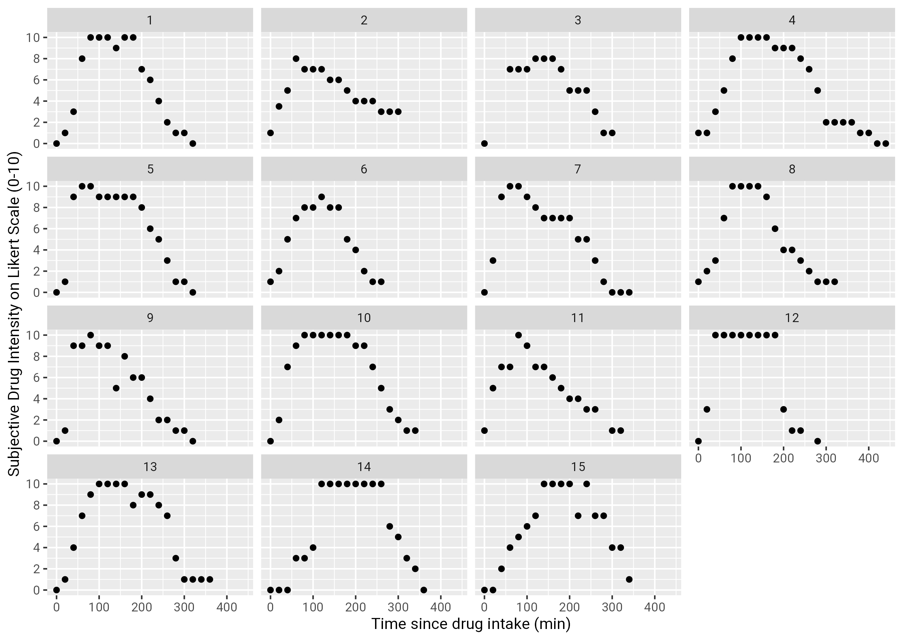

# mixedBreak: Mixed-effects Models with Unknown Breakpoints


Modelling segmented relationships with linear mixed-effects model with breakpoint(s) estimates.


## Installation (R >= 4.3.1)

You can use `pak` package to install the latest stable version of `mixedBreak`:

```r
# install.packages("pak")
pak::pak("nowahah/mixedBreak@53a429b") 
```


## Fitting a Segmented Linear Mixed-effects Model

The functionalities of the package will be exemplified on the following dataset:

```r
library(mixedBreak)
data(SDIpsilo, package = "mixedBreak")
str(SDIpsilo)
```

where the experience of 15 individuals after drug intake is monitored over time:





The `mixed.break` function can be used to model the experience of the patients using a segmented mixed model. This model not only estimates the regression coefficients in every segment, but also the breakpoint values themselves, for every individual.

```r
bp.fit <- mixed.break(
  score ~ 0 + time + (0 + time|ID),
  pattern = "101",
  data = SDIpsilo
)
```

The syntax was designed to remain close to a `lme4::lmer` call, to which one adds a `pattern` argument, used for specifying whether a non-null slope has to be estimated in the corresponding segment:

<!--- 
- `pattern=11` fits 1 breakpoints and assumes every slope is to be estimated (unconstrained) ;
- `pattern=111` fits 2 breakpoints (unconstrained) ;
- `pattern=1111` fits 3 breakpoints (unconstrained) ; 
--->
- `pattern=10` fits 1 breakpoint with a constant segment in the second phase ;
- `pattern=101` fits 2 breakpoints with a constant segment in the second phase ;
- `pattern=1010` fits 3 breakpoints with a constant segment in phases 2 & 4.

Available patterns either one of `c('10','101', '1010')`. Unconstrained model with 1 to 3 breakpoints are currently under development.


```r
plot(bp.fit, fit.avg = TRUE)
```


On the panel, one can see the marginal fit in faded red, and the individual fit in orange. Marginal fit can of course be removed by letting `fit.avg=FALSE` (default).

`summary, coef & confint` methods are implemented as conveniences.


## Model formulation and estimation

The estimation procedures is mostly based on the work on [(Muggeo, 2014)](doi:10.1177/1471082X13504721) article. The formulation of the model, in the case of the `pattern = 101`, is the following (assuming that individual breakpoints are ordered):

  
_&plus;)&plus;%5Cbeta_%7B3i%7D(t_%7Bij%7D-%5Cpsi_%7B2i%7D)_&plus;&plus;%5Cvarepsilon_%7Bij%7D=%5Cbegin%7Bcases%7D%5Cbeta_%7B1i%7Dt_%7Bij%7D&plus;%5Cvarepsilon_%7Bij%7D&%20%5Ctext%7Bif%7D%5Chspace%7B2mm%7Dt_%7Bij%7D%3C%20%5Cpsi_%7B1i%7D%5C%5C%20%5Cbeta_%7B1i%7D%5Cpsi_%7Bij%7D&plus;%5Cvarepsilon_%7Bij%7D&%20%5Ctext%7Bif%7D%5Chspace%7B2mm%7D%5Cpsi_%7B1i%7D%5Cleq%20t_%7Bij%7D%3C%20%5Cpsi_%7B2i%7D%5C%5C%20%20%5Cbeta_%7B1i%7D%5Cpsi_%7Bij%7D&plus;%5Cbeta_%7B3i%7D(t_%7Bij%7D-%5Cpsi_%7B2i%7D)&plus;%5Cvarepsilon_%7Bij%7D&%20%5Ctext%7Bif%7D%5Chspace%7B2mm%7D%5Cpsi_%7B2i%7D%5Cleq%20t_%7Bij%7D%5Cend%7Bcases%7D)


It is a piece-wise linear model of time, with random effects on the slopes &beta; and the breakpoints &psi;. This degree of freedom on the breakpoints allows for estimating subject-specific breakpoints, thus modelling heterogeneity between trajectories.

The breakpoints are modeled on a logit scale in the domain of the segmented variable, so their estimates remain constrained in this range.

The estimation algorithm is essentially an iterative procedure over approximated linearized mixed-effects models.
Muggeo implemented his own version of the algorithm in R package [`segmented`](https://cran.r-project.org/package=segmented) available on CRAN. At the time of `mixedBreak` development, it only allowed for a single breakpoint in the model.

## Limitations

<!--- - Message / Warnings explained for this situation --->

<!--- With real-life data, it comes unsurprisingly that a single pattern cannot always fit every individual for a given phenomena. --->
<!--- In the event that many individuals does not fit to the presumed pattern, they may be modeled separately with a different pattern. --->

- The specification of the model presumes (not assumes) that breakpoints are ordered to make an interpretation of its output. However, there are no mathematical constraints ensuring this order. Therefore, it could happen that some breakpoints of some individuals are switched ( _i.e._ &psi;<sub>1i</sub> > &psi;<sub>2i</sub>). In this case, the model is not invalid, but one must remain careful with the interpretation of the coefficients for the relevant individuals. A warning message is emitted if such a situation occurs.
- No intercept is allowed in the model for now ;
- No other covariates than the segmented variable is allowed in the model for now ;
- The model showed limited statistical properties (bias, undercoverage) in a simulation study carried on for a single breakpoint and across realistic Data-Generating Mechanisms.


## Contributing

Pull requests are welcome. For major changes, please open an issue first
to discuss what you would like to change.


## References

1. Segmented mixed models with random changepoints: a maximum likelihood approach with application to
treatment for depression study. Statistical Modelling. 2014 Aug ;14(4):293–313. doi:10.1177/1471082X13504721
2. segmented: Regression Models with Break-Points / Change-Points Estimation (with Possibly Random
Effects) [Internet]. 2003 [cited 2026 Mar 24]. Available from: https://cran.r-project.org/package=segmented
doi:10.32614/CRAN.package.segmented
